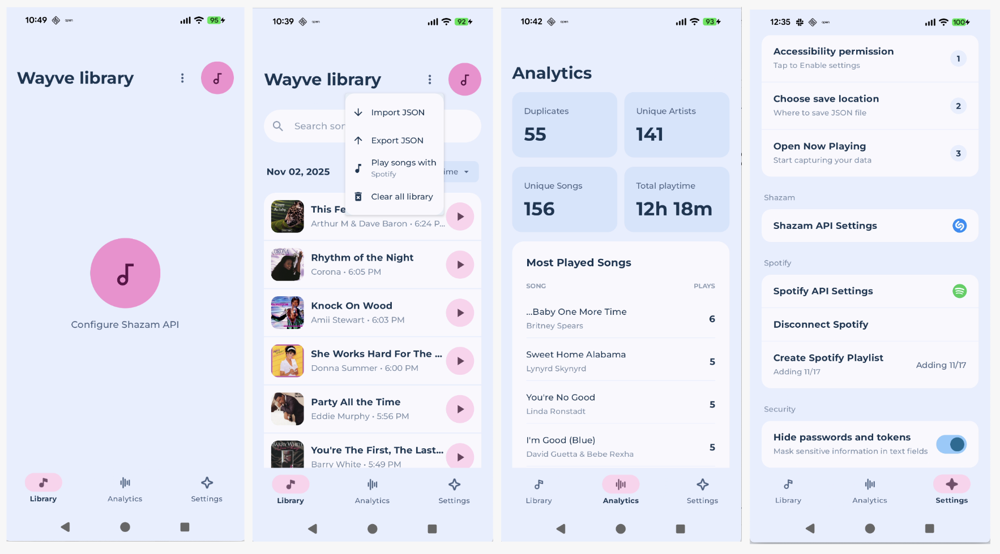
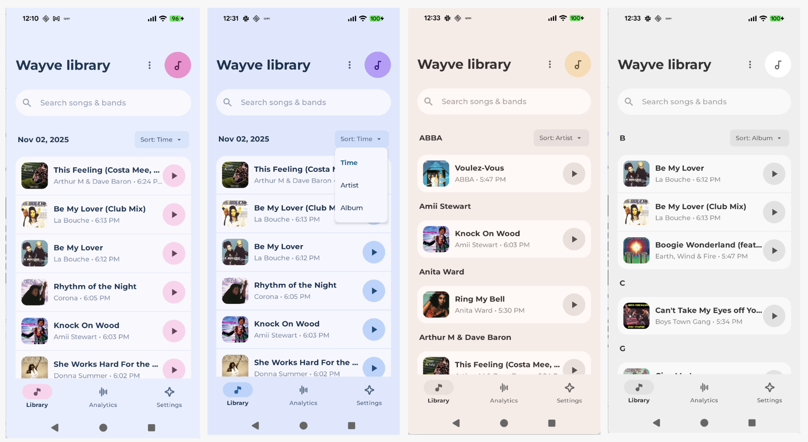

# 🎵 Wayve

**Your personal music detection companion** – automatically identify, track, and organize songs playing around you.

---

Join as beta tester here:
https://docs.google.com/forms/d/e/1FAIpQLSeJ6BW47heqKr9msmCuFhl6YEsOSjRJjatIZ6WT2XUx1bBINA/viewform

---

### Main Flow


### Themes


---

## What is Wayve?

Wayve is an Android music detection app that helps you build and manage your music library by capturing songs from multiple sources. Never lose track of that song you heard again.

## ✨ Features

### 🎤 **Ambient Music Detection**
- **Shazam Integration**: Tap to identify any song playing around you
- **Continuous Monitoring**: Auto-detect songs in the background
- **Album Art**: Automatically fetches cover art from iTunes/Shazam

### 📱 **Google Pixel Now Playing**
- Import your Now Playing history (Pixel exclusive feature)
- JSON import/export support
- Automatic capture via accessibility service

### 🎶 **Library Management**
- Beautiful Material 3 design with dynamic theming
- Swipe-to-delete tracks
- Search and filter by title, artist, or album
- Sort by time, artist, or album with smart grouping
- Auto-play: Launch songs in YouTube, Spotify, YT Music, or YT Revanced

### 📊 **Analytics Dashboard**
- Track duplicates and unique songs/artists
- Total playtime calculations
- Most played songs detection
- Real-time statistics

### 🎧 **Spotify Integration**
- OAuth 2.0 with PKCE (secure authentication)
- Export library to Spotify playlists
- One-click playlist creation

---

## 🛠️ Tech Stack

- **Language**: Kotlin
- **UI**: Jetpack Compose + Material 3
- **Architecture**: MVVM with ViewModels
- **APIs**: 
  - Shazam (via RapidAPI) for music recognition
  - iTunes Search API for album art backfill
  - Spotify Web API for playlist creation
- **Storage**: SharedPreferences + DataStore
- **Dependencies**: OkHttp, Coil (image loading), Spotify Android Auth SDK

---

## 🚀 Setup

### Prerequisites
- Android Studio (latest version)
- Android device/emulator running API 24+
- **Shazam API Key** (free 500 requests/month from [RapidAPI](https://rapidapi.com/apidojo/api/shazam))
- **Spotify Developer Account** (optional, for playlist export)

### Quick Start

1. Clone the repository
```bash
git clone <repository-url>
cd wayve
```

2. Open in Android Studio

3. Configure APIs in the app:
   - **Shazam**: Settings → Shazam API Settings → Enter your RapidAPI key
   - **Spotify**: Settings → Spotify Settings → Enter Client ID & Secret

4. Build and run!

---

## 📝 Configuration

### Shazam API Setup
1. Sign up at [RapidAPI Shazam](https://rapidapi.com/apidojo/api/shazam)
2. Subscribe to the free tier (500 requests/month)
3. Copy your API key
4. Open Wayve → Settings → Shazam API Settings
5. Paste your API key and save

### Spotify Integration (Optional)
1. Create an app at [Spotify Developer Dashboard](https://developer.spotify.com/dashboard)
2. Add redirect URI: `wayve://spotify-callback`
3. Copy Client ID and Client Secret
4. Open Wayve → Settings → Spotify Settings
5. Enter credentials and authenticate

---

## 🎯 Use Cases

- **Discover**: Identify songs at cafés, parties, or on the radio
- **Track**: Build a history of all music you've encountered
- **Organize**: Sort and search your music library
- **Export**: Create Spotify playlists from your discoveries
- **Analyze**: See your listening patterns and most detected songs

---

## 🔒 Privacy

- All data is stored **locally on your device**
- No cloud sync or external servers (except API calls)
- API keys are stored securely in encrypted SharedPreferences
- OAuth tokens are kept local and never shared

---

## 📄 License

This project is for personal use.

---

## 🤝 Contributing

This is a personal project, but feel free to fork and customize for your own use!

---

**Made with ❤️ for music lovers**

